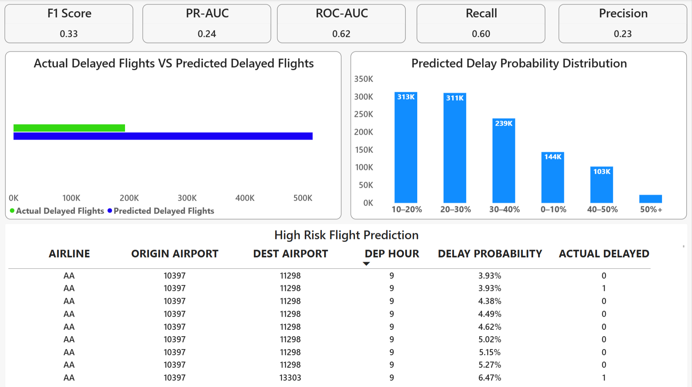

# Flight Delay Prediction

## Project

A machine learning project that predicts whether a U.S. flight will arrive at least 15 minutes late using 2015 flight data.

## Dataset

The dataset contains approximately 5.8 million U.S. flight records from 2015.

Source: Hugging Face  
https://huggingface.co/datasets/hsanchezp/us-dot-flight-delays-2015

## What We Did

- Cleaned and explored the flight data
- Analyzed delays by airline, airport, route, and time
- Excluded cancelled and diverted flights from the prediction population
- Created a binary delay target
- Used an 80/20 chronological train-test split
- Created historical airline, airport, and route delay features
- Added an airline × departure-hour interaction
- Tested Logistic Regression and HistGradientBoosting
- Selected Logistic Regression as the final model
- Evaluated ROC-AUC, PR-AUC, Precision, Recall, and F1
- Used a 0.25 probability threshold

## Model Results

| Metric | Result |
|---|---:|
| ROC-AUC | 0.6207 |
| PR-AUC | 0.2422 |
| Precision | 22.51% |
| Recall | 60.39% |
| F1 Score | 32.80% |

## Tools Used

Python, Pandas, NumPy, Scikit-learn, Jupyter Notebook, PostgreSQL, SQL, Power BI, Git, GitHub

## Power BI Dashboard

## Limitations

- U.S. flight data from 2015 only
- No weather data
- No real-time data
- Performance may change on newer or different data

## Future Improvements

- Add weather data
- Use newer flight data
- Test additional machine learning models
- Predict delay duration
- Build an API
- Add real-time prediction